Beyond Stan: Other Spatial Model Fitting Options
================

## Software Demos

  - We are going to look at a couple options for fitting spatial models.

<!-- end list -->

1.  `krige.bayes()` in `geoR`,
2.  `krige.conv()` in `geoR`,
3.  `spLM()` in `spBayes`, and

## `krige.bayes()` demo

  - For this demonstration we will explore the `krige.bayes()` function
    in R using a modified script from the function description. With
    this exploration, answer the following questions.

<!-- end list -->

``` r
set.seed(03042021)

# generating a simulated realization from Gaussian random field
ex_data <- grf(100, cov.pars=c(10, .15), cov.model="exponential", nugget = 1)
```

    ## grf: simulation(s) on randomly chosen locations with  100  points
    ## grf: process with  1  covariance structure(s)
    ## grf: nugget effect is: tausq= 1 
    ## grf: covariance model 1 is: exponential(sigmasq=10, phi=0.15)
    ## grf: decomposition algorithm used is:  cholesky 
    ## grf: End of simulation procedure. Number of realizations: 1

``` r
tibble(x1 = ex_data$coords[,'x'], x2 = ex_data$coords[,'y'], y = ex_data$data) %>% 
  ggplot(aes(x = x1, y = x2)) + geom_point(aes(color = y)) +
  scale_color_gradient2() + theme_minimal()
```

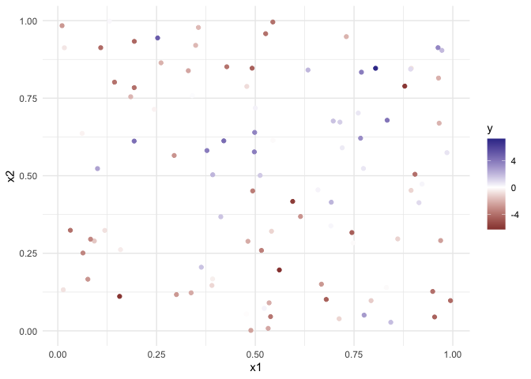<!-- -->

``` r
# Variogram
plot(variog(ex_data, max.dist=1))
```

    ## variog: computing omnidirectional variogram

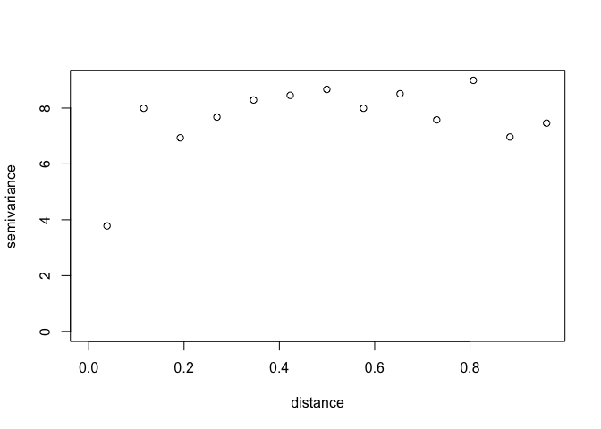<!-- -->

``` r
# defining the grid of prediction locations:
ex_grid <- as.matrix(expand.grid(seq(0,1,length.out = 15), seq(0,1,length.out = 15)))

# computing posterior and predictive distributions
ex_bayes <- krige.bayes(ex_data, locations = ex_grid,
                        model = model.control(cov.m="exponential"),
                        prior = prior.control(beta.prior = 'flat',
                                              sigmasq.prior = 'reciprocal',
                                              phi.discrete=seq(0, 0.7, l=25),
                                              phi.prior="uniform", 
                                              tausq.rel.discrete = seq(0, 1, l=25),
                                              tausq.rel.prior = 'uniform'))
```

    ## krige.bayes: results will be returned only for prediction locations inside the borders
    ## krige.bayes: model with constant mean
    ## krige.bayes: computing the discrete posterior of phi/tausq.rel
    ## krige.bayes: computing the posterior probabilities.
    ##              Number of parameter sets:  625 
    ## 1, 101, 201, 301, 401, 501, 601, 
    ## 
    ## krige.bayes: sampling from posterior distribution
    ## krige.bayes: sample from the (joint) posterior of phi and tausq.rel
    ##                  [,1]   [,2]      [,3]       [,4]        [,5]       [,6]
    ## phi        0.05833333 0.0875 0.1166667 0.02916667  0.05833333 0.08750000
    ## tausq.rel  0.00000000 0.0000 0.0000000 0.04166667  0.04166667 0.04166667
    ## frequency 10.00000000 5.0000 2.0000000 2.00000000 20.00000000 8.00000000
    ##                 [,7]       [,8]       [,9]      [,10]       [,11]       [,12]
    ## phi       0.11666667 0.14583333 0.17500000 0.37916667  0.05833333  0.08750000
    ## tausq.rel 0.04166667 0.04166667 0.04166667 0.04166667  0.08333333  0.08333333
    ## frequency 5.00000000 3.00000000 1.00000000 1.00000000 17.00000000 19.00000000
    ##                [,13]      [,14]      [,15]      [,16]      [,17]      [,18]
    ## phi       0.11666667 0.14583333 0.17500000 0.20416667 0.23333333 0.43750000
    ## tausq.rel 0.08333333 0.08333333 0.08333333 0.08333333 0.08333333 0.08333333
    ## frequency 7.00000000 5.00000000 1.00000000 1.00000000 1.00000000 1.00000000
    ##                [,19]      [,20]       [,21]   [,22]      [,23]     [,24] [,25]
    ## phi       0.49583333 0.58333333  0.05833333  0.0875  0.1166667 0.1458333 0.175
    ## tausq.rel 0.08333333 0.08333333  0.12500000  0.1250  0.1250000 0.1250000 0.125
    ## frequency 1.00000000 1.00000000 19.00000000 14.0000 10.0000000 6.0000000 2.000
    ##               [,26]     [,27]     [,28] [,29]      [,30]      [,31]     [,32]
    ## phi       0.3208333 0.3791667 0.6708333 0.700 0.05833333  0.0875000 0.1166667
    ## tausq.rel 0.1250000 0.1250000 0.1250000 0.125 0.16666667  0.1666667 0.1666667
    ## frequency 1.0000000 3.0000000 2.0000000 1.000 8.00000000 16.0000000 9.0000000
    ##               [,33]     [,34]     [,35]     [,36]     [,37]     [,38]     [,39]
    ## phi       0.1458333 0.1750000 0.2041667 0.2333333 0.2916667 0.3208333 0.5541667
    ## tausq.rel 0.1666667 0.1666667 0.1666667 0.1666667 0.1666667 0.1666667 0.1666667
    ## frequency 6.0000000 4.0000000 1.0000000 3.0000000 1.0000000 1.0000000 1.0000000
    ##               [,40]      [,41]      [,42]      [,43]      [,44]     [,45]
    ## phi       0.6416667 0.02916667 0.05833333  0.0875000  0.1166667 0.1458333
    ## tausq.rel 0.1666667 0.20833333 0.20833333  0.2083333  0.2083333 0.2083333
    ## frequency 2.0000000 1.00000000 8.00000000 26.0000000 13.0000000 7.0000000
    ##               [,46]     [,47]     [,48]     [,49]     [,50]     [,51]
    ## phi       0.2041667 0.2333333 0.3208333 0.3500000 0.4375000 0.4958333
    ## tausq.rel 0.2083333 0.2083333 0.2083333 0.2083333 0.2083333 0.2083333
    ## frequency 2.0000000 2.0000000 1.0000000 1.0000000 1.0000000 1.0000000
    ##                [,52]      [,53]   [,54]     [,55]     [,56] [,57]     [,58]
    ## phi       0.02916667 0.05833333  0.0875 0.1166667 0.1458333 0.175 0.2041667
    ## tausq.rel 0.25000000 0.25000000  0.2500 0.2500000 0.2500000 0.250 0.2500000
    ## frequency 1.00000000 8.00000000 14.0000 9.0000000 1.0000000 6.000 1.0000000
    ##               [,59]     [,60] [,61]  [,62] [,63]     [,64]      [,65]
    ## phi       0.2333333 0.2916667  0.35 0.4375 0.525 0.5541667 0.05833333
    ## tausq.rel 0.2500000 0.2500000  0.25 0.2500 0.250 0.2500000 0.29166667
    ## frequency 3.0000000 2.0000000  1.00 1.0000 1.000 1.0000000 9.00000000
    ##                [,66]      [,67]     [,68]     [,69]     [,70]     [,71]
    ## phi        0.0875000  0.1166667 0.1458333 0.1750000 0.2041667 0.2333333
    ## tausq.rel  0.2916667  0.2916667 0.2916667 0.2916667 0.2916667 0.2916667
    ## frequency 18.0000000 13.0000000 9.0000000 1.0000000 2.0000000 1.0000000
    ##               [,72]     [,73]     [,74]     [,75]     [,76]     [,77]
    ## phi       0.2625000 0.3208333 0.3500000 0.3791667 0.4958333 0.7000000
    ## tausq.rel 0.2916667 0.2916667 0.2916667 0.2916667 0.2916667 0.2916667
    ## frequency 1.0000000 1.0000000 1.0000000 1.0000000 1.0000000 2.0000000
    ##                [,78]      [,79]     [,80]     [,81]     [,82]     [,83]
    ## phi       0.05833333  0.0875000 0.1166667 0.1458333 0.1750000 0.2333333
    ## tausq.rel 0.33333333  0.3333333 0.3333333 0.3333333 0.3333333 0.3333333
    ## frequency 8.00000000 10.0000000 8.0000000 8.0000000 3.0000000 1.0000000
    ##               [,84]     [,85]     [,86]     [,87]     [,88]     [,89]     [,90]
    ## phi       0.2625000 0.2916667 0.3208333 0.3500000 0.4083333 0.4375000 0.4666667
    ## tausq.rel 0.3333333 0.3333333 0.3333333 0.3333333 0.3333333 0.3333333 0.3333333
    ## frequency 1.0000000 3.0000000 1.0000000 1.0000000 1.0000000 1.0000000 1.0000000
    ##               [,91]     [,92]     [,93]      [,94]   [,95]      [,96]     [,97]
    ## phi       0.4958333 0.5250000 0.6125000 0.05833333  0.0875  0.1166667 0.1458333
    ## tausq.rel 0.3333333 0.3333333 0.3333333 0.37500000  0.3750  0.3750000 0.3750000
    ## frequency 1.0000000 1.0000000 1.0000000 7.00000000 16.0000 11.0000000 6.0000000
    ##           [,98]     [,99]    [,100] [,101]    [,102]    [,103] [,104]    [,105]
    ## phi       0.175 0.2041667 0.2333333 0.2625 0.2916667 0.3208333 0.4375 0.4666667
    ## tausq.rel 0.375 0.3750000 0.3750000 0.3750 0.3750000 0.3750000 0.3750 0.3750000
    ## frequency 3.000 4.0000000 2.0000000 1.0000 1.0000000 1.0000000 1.0000 1.0000000
    ##           [,106]     [,107]     [,108]     [,109]    [,110]    [,111]    [,112]
    ## phi        0.525 0.05833333  0.0875000  0.1166667 0.1458333 0.1750000 0.2333333
    ## tausq.rel  0.375 0.41666667  0.4166667  0.4166667 0.4166667 0.4166667 0.4166667
    ## frequency  2.000 5.00000000 13.0000000 11.0000000 6.0000000 3.0000000 2.0000000
    ##              [,113]    [,114]    [,115]    [,116]    [,117]     [,118]
    ## phi       0.2625000 0.2916667 0.3208333 0.3500000 0.7000000 0.05833333
    ## tausq.rel 0.4166667 0.4166667 0.4166667 0.4166667 0.4166667 0.45833333
    ## frequency 1.0000000 1.0000000 2.0000000 1.0000000 1.0000000 5.00000000
    ##               [,119]     [,120]    [,121]    [,122]    [,123]    [,124]
    ## phi        0.0875000  0.1166667 0.1458333 0.1750000 0.2041667 0.2333333
    ## tausq.rel  0.4583333  0.4583333 0.4583333 0.4583333 0.4583333 0.4583333
    ## frequency 10.0000000 10.0000000 5.0000000 3.0000000 1.0000000 3.0000000
    ##              [,125]    [,126]    [,127]    [,128]    [,129]    [,130]
    ## phi       0.2625000 0.4083333 0.4375000 0.5250000 0.6708333 0.7000000
    ## tausq.rel 0.4583333 0.4583333 0.4583333 0.4583333 0.4583333 0.4583333
    ## frequency 2.0000000 1.0000000 1.0000000 1.0000000 1.0000000 1.0000000
    ##               [,131] [,132]    [,133]    [,134] [,135]    [,136]    [,137]
    ## phi       0.05833333 0.0875 0.1166667 0.1458333  0.175 0.2041667 0.2333333
    ## tausq.rel 0.50000000 0.5000 0.5000000 0.5000000  0.500 0.5000000 0.5000000
    ## frequency 5.00000000 9.0000 9.0000000 8.0000000  4.000 4.0000000 1.0000000
    ##           [,138]    [,139]    [,140] [,141]    [,142] [,143]    [,144]
    ## phi       0.2625 0.2916667 0.3208333   0.35 0.4083333 0.4375 0.4666667
    ## tausq.rel 0.5000 0.5000000 0.5000000   0.50 0.5000000 0.5000 0.5000000
    ## frequency 2.0000 2.0000000 1.0000000   1.00 1.0000000 1.0000 1.0000000
    ##              [,145] [,146]    [,147]    [,148] [,149]    [,150] [,151]
    ## phi       0.4958333  0.525 0.5541667 0.5833333 0.6125 0.6708333    0.7
    ## tausq.rel 0.5000000  0.500 0.5000000 0.5000000 0.5000 0.5000000    0.5
    ## frequency 1.0000000  1.000 1.0000000 1.0000000 3.0000 1.0000000    2.0
    ##               [,152]    [,153]    [,154]    [,155]    [,156]    [,157]
    ## phi       0.05833333 0.0875000 0.1166667 0.1458333 0.1750000 0.2041667
    ## tausq.rel 0.54166667 0.5416667 0.5416667 0.5416667 0.5416667 0.5416667
    ## frequency 3.00000000 7.0000000 7.0000000 7.0000000 1.0000000 2.0000000
    ##              [,158]    [,159]    [,160]    [,161]    [,162]    [,163]    [,164]
    ## phi       0.2333333 0.2916667 0.3500000 0.4375000 0.4958333 0.5541667 0.6125000
    ## tausq.rel 0.5416667 0.5416667 0.5416667 0.5416667 0.5416667 0.5416667 0.5416667
    ## frequency 4.0000000 1.0000000 1.0000000 2.0000000 1.0000000 1.0000000 1.0000000
    ##              [,165]    [,166]    [,167]    [,168]    [,169]    [,170]    [,171]
    ## phi       0.7000000 0.0875000 0.1166667 0.1458333 0.1750000 0.2041667 0.2333333
    ## tausq.rel 0.5416667 0.5833333 0.5833333 0.5833333 0.5833333 0.5833333 0.5833333
    ## frequency 1.0000000 6.0000000 7.0000000 1.0000000 2.0000000 1.0000000 1.0000000
    ##              [,172]    [,173]    [,174]    [,175]    [,176]    [,177]
    ## phi       0.2625000 0.3208333 0.3791667 0.5541667 0.6416667 0.6708333
    ## tausq.rel 0.5833333 0.5833333 0.5833333 0.5833333 0.5833333 0.5833333
    ## frequency 1.0000000 1.0000000 1.0000000 1.0000000 1.0000000 1.0000000
    ##               [,178] [,179]    [,180]    [,181] [,182]    [,183]    [,184]
    ## phi       0.05833333 0.0875 0.1166667 0.1458333  0.175 0.2041667 0.2333333
    ## tausq.rel 0.62500000 0.6250 0.6250000 0.6250000  0.625 0.6250000 0.6250000
    ## frequency 3.00000000 8.0000 6.0000000 4.0000000  2.000 1.0000000 2.0000000
    ##           [,185]    [,186] [,187]    [,188]    [,189]    [,190]    [,191]
    ## phi       0.2625 0.2916667  0.350 0.4083333 0.6708333 0.0875000 0.1166667
    ## tausq.rel 0.6250 0.6250000  0.625 0.6250000 0.6250000 0.6666667 0.6666667
    ## frequency 3.0000 3.0000000  1.000 1.0000000 2.0000000 6.0000000 6.0000000
    ##              [,192]    [,193]    [,194]    [,195]    [,196]    [,197]    [,198]
    ## phi       0.1458333 0.1750000 0.2041667 0.2333333 0.2625000 0.2916667 0.3208333
    ## tausq.rel 0.6666667 0.6666667 0.6666667 0.6666667 0.6666667 0.6666667 0.6666667
    ## frequency 5.0000000 3.0000000 1.0000000 1.0000000 2.0000000 1.0000000 1.0000000
    ##              [,199]    [,200]    [,201]     [,202]    [,203]    [,204]
    ## phi       0.3500000 0.4375000 0.6125000 0.05833333 0.0875000 0.1166667
    ## tausq.rel 0.6666667 0.6666667 0.6666667 0.70833333 0.7083333 0.7083333
    ## frequency 1.0000000 1.0000000 1.0000000 1.00000000 2.0000000 7.0000000
    ##              [,205]    [,206]    [,207]    [,208]    [,209]    [,210]    [,211]
    ## phi       0.1458333 0.1750000 0.2041667 0.2333333 0.2625000 0.3208333 0.3500000
    ## tausq.rel 0.7083333 0.7083333 0.7083333 0.7083333 0.7083333 0.7083333 0.7083333
    ## frequency 2.0000000 6.0000000 4.0000000 1.0000000 3.0000000 1.0000000 1.0000000
    ##              [,212]    [,213]    [,214]    [,215] [,216]    [,217]    [,218]
    ## phi       0.3791667 0.4375000 0.5833333 0.7000000 0.0875 0.1166667 0.1458333
    ## tausq.rel 0.7083333 0.7083333 0.7083333 0.7083333 0.7500 0.7500000 0.7500000
    ## frequency 2.0000000 2.0000000 1.0000000 1.0000000 5.0000 6.0000000 5.0000000
    ##           [,219]    [,220] [,221] [,222]    [,223] [,224] [,225]     [,226]
    ## phi        0.175 0.2041667 0.2625   0.35 0.3791667 0.4375 0.6125 0.05833333
    ## tausq.rel  0.750 0.7500000 0.7500   0.75 0.7500000 0.7500 0.7500 0.79166667
    ## frequency  3.000 2.0000000 1.0000   2.00 1.0000000 2.0000 1.0000 2.00000000
    ##              [,227]    [,228]    [,229]    [,230]    [,231]    [,232]    [,233]
    ## phi       0.0875000 0.1166667 0.1458333 0.1750000 0.2041667 0.2333333 0.2625000
    ## tausq.rel 0.7916667 0.7916667 0.7916667 0.7916667 0.7916667 0.7916667 0.7916667
    ## frequency 7.0000000 6.0000000 7.0000000 2.0000000 1.0000000 2.0000000 2.0000000
    ##              [,234]    [,235]    [,236]    [,237]     [,238]    [,239]
    ## phi       0.3208333 0.4666667 0.4958333 0.5541667 0.05833333 0.0875000
    ## tausq.rel 0.7916667 0.7916667 0.7916667 0.7916667 0.83333333 0.8333333
    ## frequency 2.0000000 1.0000000 1.0000000 1.0000000 2.00000000 5.0000000
    ##              [,240]    [,241]    [,242]    [,243]    [,244]    [,245]    [,246]
    ## phi       0.1166667 0.1458333 0.1750000 0.2041667 0.2333333 0.2916667 0.3208333
    ## tausq.rel 0.8333333 0.8333333 0.8333333 0.8333333 0.8333333 0.8333333 0.8333333
    ## frequency 6.0000000 7.0000000 3.0000000 1.0000000 1.0000000 1.0000000 2.0000000
    ##              [,247]    [,248]    [,249]     [,250] [,251]    [,252]    [,253]
    ## phi       0.3500000 0.4958333 0.5833333 0.05833333 0.0875 0.1166667 0.1458333
    ## tausq.rel 0.8333333 0.8333333 0.8333333 0.87500000 0.8750 0.8750000 0.8750000
    ## frequency 1.0000000 1.0000000 1.0000000 1.00000000 7.0000 2.0000000 2.0000000
    ##           [,254]    [,255]    [,256] [,257]    [,258] [,259]    [,260]
    ## phi        0.175 0.2041667 0.2333333 0.2625 0.2916667  0.350 0.3791667
    ## tausq.rel  0.875 0.8750000 0.8750000 0.8750 0.8750000  0.875 0.8750000
    ## frequency  1.000 1.0000000 4.0000000 4.0000 1.0000000  2.000 1.0000000
    ##              [,261]    [,262]    [,263]    [,264]    [,265]    [,266]    [,267]
    ## phi       0.6416667 0.0875000 0.1166667 0.1458333 0.1750000 0.2041667 0.2333333
    ## tausq.rel 0.8750000 0.9166667 0.9166667 0.9166667 0.9166667 0.9166667 0.9166667
    ## frequency 1.0000000 3.0000000 3.0000000 1.0000000 3.0000000 3.0000000 2.0000000
    ##              [,268]    [,269]    [,270]    [,271]     [,272]    [,273]
    ## phi       0.2625000 0.2916667 0.4083333 0.6125000 0.05833333 0.0875000
    ## tausq.rel 0.9166667 0.9166667 0.9166667 0.9166667 0.95833333 0.9583333
    ## frequency 3.0000000 1.0000000 1.0000000 1.0000000 2.00000000 4.0000000
    ##              [,274]    [,275]    [,276]    [,277]    [,278]    [,279]    [,280]
    ## phi       0.1166667 0.1458333 0.1750000 0.2041667 0.2333333 0.2625000 0.2916667
    ## tausq.rel 0.9583333 0.9583333 0.9583333 0.9583333 0.9583333 0.9583333 0.9583333
    ## frequency 6.0000000 3.0000000 2.0000000 2.0000000 3.0000000 1.0000000 1.0000000
    ##              [,281]    [,282]    [,283]    [,284]    [,285]     [,286] [,287]
    ## phi       0.3500000 0.4083333 0.4666667 0.5250000 0.6125000 0.05833333 0.0875
    ## tausq.rel 0.9583333 0.9583333 0.9583333 0.9583333 0.9583333 1.00000000 1.0000
    ## frequency 1.0000000 2.0000000 1.0000000 1.0000000 1.0000000 1.00000000 3.0000
    ##              [,288]    [,289] [,290]    [,291]    [,292]    [,293]    [,294]
    ## phi       0.1166667 0.1458333  0.175 0.2333333 0.4666667 0.4958333 0.6708333
    ## tausq.rel 1.0000000 1.0000000  1.000 1.0000000 1.0000000 1.0000000 1.0000000
    ## frequency 5.0000000 3.0000000  3.000 1.0000000 1.0000000 1.0000000 1.0000000
    ## 
    ## krige.bayes: starting prediction at the provided locations
    ## krige.bayes: phi/tausq.rel samples for the predictive are same as for the posterior 
    ## krige.bayes: computing moments of the predictive distribution
    ## krige.bayes: sampling from the predictive
    ##              Number of parameter sets:  294 
    ## 1, 11, 21, 31, 41, 51, 61, 71, 81, 91, 101, 111, 121, 131, 141, 151, 161, 171, 181, 191, 201, 211, 221, 231, 241, 251, 261, 271, 281, 291, 
    ## krige.bayes: preparing summaries of the predictive distribution

``` r
# Plot histograms with samples from the posterior
hist(ex_bayes)
```

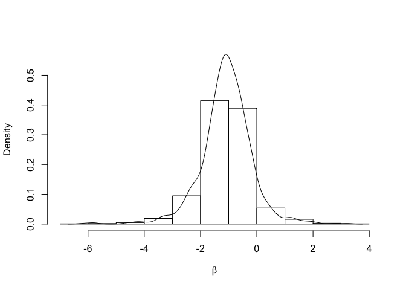<!-- -->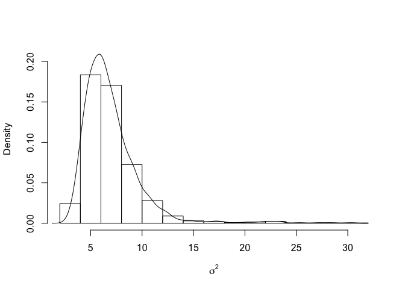<!-- -->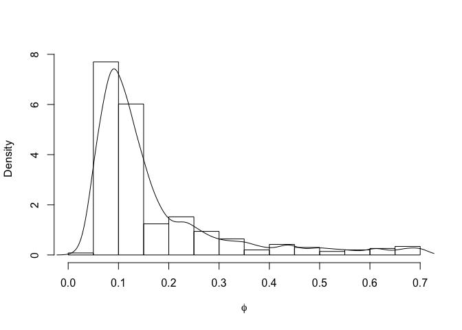<!-- -->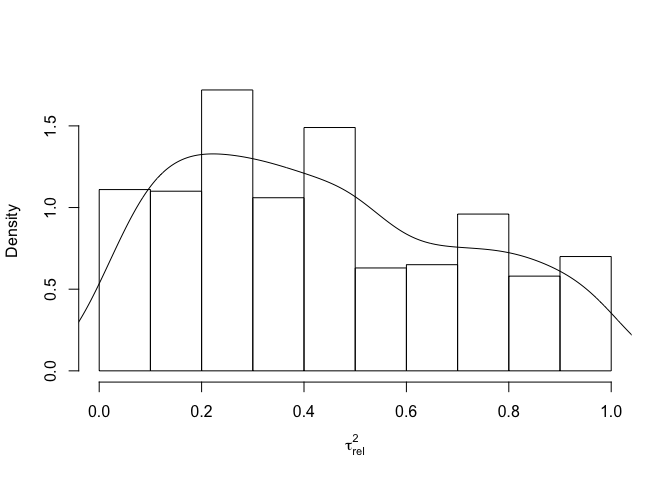<!-- -->

``` r
# Plotting some prediction results
image(ex_bayes, val = 'mean', main="predicted values")
```

    ## mapping the means of the predictive distribution

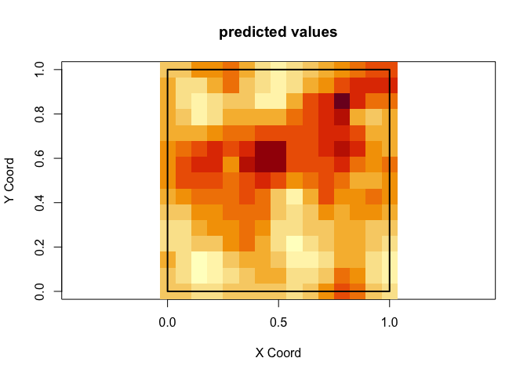<!-- -->

``` r
image(ex_bayes, val="variance", main="prediction variance")
```

    ## mapping the variances of the predictive distribution

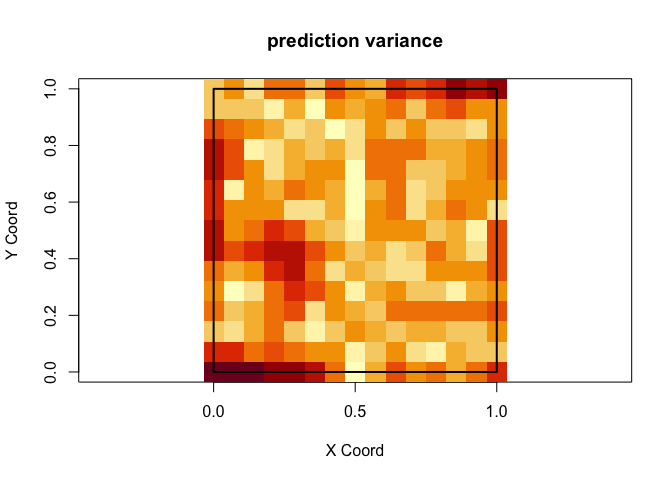<!-- -->

``` r
image(ex_bayes, val= "simulation", number.col=1,
      main="a simulation from the \npredictive distribution")
```

    ## mapping a simulation from the predictive distribution

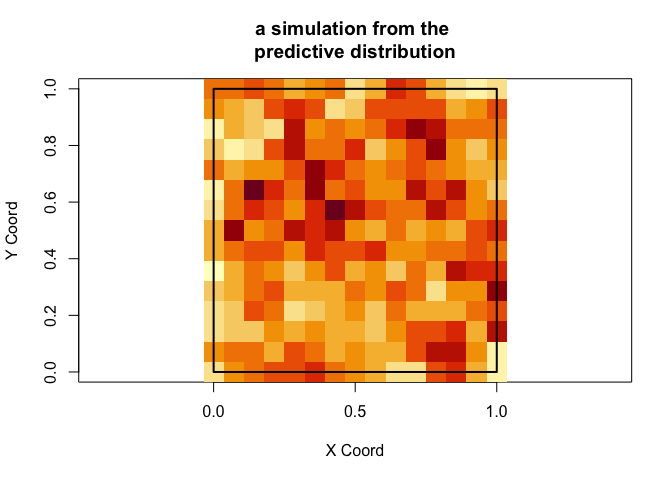<!-- -->

``` r
image(ex_bayes, val= "simulation", number.col=2,
      main="another simulation from \nthe predictive distribution")
```

    ## mapping a simulation from the predictive distribution

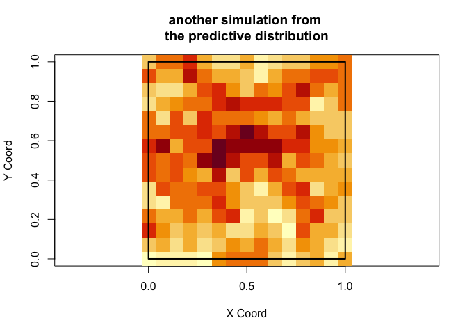<!-- -->

## `krige.conv()` demo

  - For this demonstration we will explore the `krige.bayes()` function
    in R using a modified script from the function description. With
    this exploration, answer the following questions.

<!-- end list -->

``` r
plot(variog(ex_data, max.dist=1))
```

    ## variog: computing omnidirectional variogram

<!-- -->

``` r
## fit covariance parameters from variogram
variogram_params <- likfit(ex_data, ini = c(5, 0.3))
```

    ## ---------------------------------------------------------------
    ## likfit: likelihood maximisation using the function optim.
    ## likfit: Use control() to pass additional
    ##          arguments for the maximisation function.
    ##         For further details see documentation for optim.
    ## likfit: It is highly advisable to run this function several
    ##         times with different initial values for the parameters.
    ## likfit: WARNING: This step can be time demanding!
    ## ---------------------------------------------------------------
    ## likfit: end of numerical maximisation.

``` r
summary(variogram_params)
```

    ## Summary of the parameter estimation
    ## -----------------------------------
    ## Estimation method: maximum likelihood 
    ## 
    ## Parameters of the mean component (trend):
    ##   beta 
    ## -0.959 
    ## 
    ## Parameters of the spatial component:
    ##    correlation function: exponential
    ##       (estimated) variance parameter sigmasq (partial sill) =  7.313
    ##       (estimated) cor. fct. parameter phi (range parameter)  =  0.0685
    ##    anisotropy parameters:
    ##       (fixed) anisotropy angle = 0  ( 0 degrees )
    ##       (fixed) anisotropy ratio = 1
    ## 
    ## Parameter of the error component:
    ##       (estimated) nugget =  0.6628
    ## 
    ## Transformation parameter:
    ##       (fixed) Box-Cox parameter = 1 (no transformation)
    ## 
    ## Practical Range with cor=0.05 for asymptotic range: 0.205241
    ## 
    ## Maximised Likelihood:
    ##    log.L n.params      AIC      BIC 
    ##   "-236"      "4"    "480"  "490.4" 
    ## 
    ## non spatial model:
    ##    log.L n.params      AIC      BIC 
    ## "-245.1"      "2"  "494.2"  "499.4" 
    ## 
    ## Call:
    ## likfit(geodata = ex_data, ini.cov.pars = c(5, 0.3))

``` r
ex_conv <- krige.conv(ex_data, loc=ex_grid,
                        krige = krige.control(obj.model = variogram_params))
```

    ## krige.conv: results will be returned only for prediction locations inside the borders
    ## krige.conv: model with constant mean
    ## krige.conv: Kriging performed using global neighbourhood

``` r
summary(ex_conv)
```

    ##              Length Class  Mode     
    ## predict      225    -none- numeric  
    ## krige.var    225    -none- numeric  
    ## beta.est       1    -none- numeric  
    ## distribution   1    -none- character
    ## message        1    -none- character
    ## call           4    -none- call

``` r
# Plotting some prediction results
image(ex_conv, main="mean predictions")
```

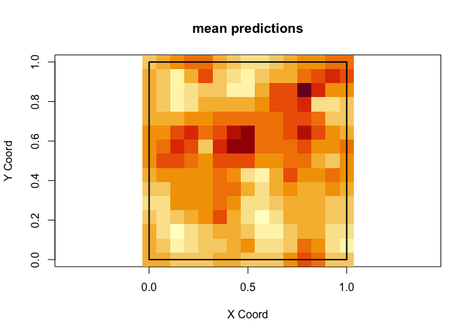<!-- -->

## `spLM()` demo

  - Another option for fitting Bayesian spatial models is the `spLM()`
    function in the `spBayes` package. Using the code on the next slide,
    answer the following questions.

## Code

``` r
rmvn <- function(n, mu=0, V = matrix(1)){
  # function to generate spatial random effects
  p <- length(mu)
  if(any(is.na(match(dim(V),p))))
    stop("Dimension problem!")
  D <- chol(V)
  t(matrix(rnorm(n*p), ncol=p)%*%D + rep(mu,rep(n,p)))
}

n <- 200
coords <- cbind(runif(n,0,10), runif(n,0,10))
X <- as.matrix(cbind(1, rnorm(n)))

beta <- as.matrix(c(1,5))
p <- length(beta)

sigma.sq <- 2
tau.sq <- 0.1
phi <- 3

D <- as.matrix(dist(coords))
H <- exp(-D/ phi)
w <- rmvn(1, rep(0,n), sigma.sq * H)
y <- rnorm(n, X %*% beta + w, sqrt(tau.sq))

tibble(x1 = coords[,1], x2 = coords[,2], y = y) %>% ggplot(aes(x = x1, y = x2)) + geom_point(aes(color = y)) + scale_color_gradient2() + theme_minimal() 
```

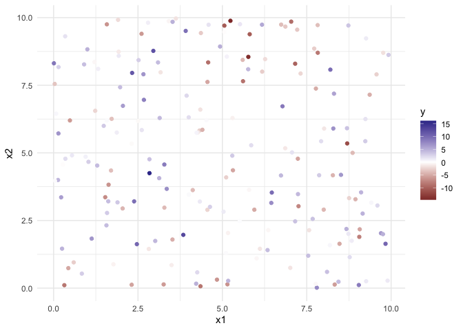<!-- -->

``` r
n.samples <- 5000

starting <- list("phi"=2, "sigma.sq"=50, "tau.sq"=1)

tuning <- list("phi"=.1, "sigma.sq"=.1, "tau.sq"=.1)

priors <- list("beta.Norm"=list(rep(0,p), diag(1000,p)),
                 "phi.Unif"=c(.1, 9), "sigma.sq.IG"=c(2, 2),
                 "tau.sq.IG"=c(2, 0.1))

m.1 <- spLM(y~X-1, coords=coords, starting=starting,
            tuning=tuning, priors=priors, cov.model="exponential",
            n.samples=n.samples, verbose=TRUE, n.report=500)
```

    ## ----------------------------------------
    ##  General model description
    ## ----------------------------------------
    ## Model fit with 200 observations.
    ## 
    ## Number of covariates 2 (including intercept if specified).
    ## 
    ## Using the exponential spatial correlation model.
    ## 
    ## Number of MCMC samples 5000.
    ## 
    ## Priors and hyperpriors:
    ##  beta normal:
    ##  mu: 0.000   0.000   
    ##  cov:
    ##  1000.000    0.000   
    ##  0.000   1000.000    
    ## 
    ##  sigma.sq IG hyperpriors shape=2.00000 and scale=2.00000
    ##  tau.sq IG hyperpriors shape=2.00000 and scale=0.10000
    ##  phi Unif hyperpriors a=0.10000 and b=9.00000
    ## -------------------------------------------------
    ##      Sampling
    ## -------------------------------------------------
    ## Sampled: 500 of 5000, 10.00%
    ## Report interval Metrop. Acceptance rate: 32.80%
    ## Overall Metrop. Acceptance rate: 32.80%
    ## -------------------------------------------------
    ## Sampled: 1000 of 5000, 20.00%
    ## Report interval Metrop. Acceptance rate: 31.20%
    ## Overall Metrop. Acceptance rate: 32.00%
    ## -------------------------------------------------
    ## Sampled: 1500 of 5000, 30.00%
    ## Report interval Metrop. Acceptance rate: 33.60%
    ## Overall Metrop. Acceptance rate: 32.53%
    ## -------------------------------------------------
    ## Sampled: 2000 of 5000, 40.00%
    ## Report interval Metrop. Acceptance rate: 31.80%
    ## Overall Metrop. Acceptance rate: 32.35%
    ## -------------------------------------------------
    ## Sampled: 2500 of 5000, 50.00%
    ## Report interval Metrop. Acceptance rate: 31.60%
    ## Overall Metrop. Acceptance rate: 32.20%
    ## -------------------------------------------------
    ## Sampled: 3000 of 5000, 60.00%
    ## Report interval Metrop. Acceptance rate: 31.40%
    ## Overall Metrop. Acceptance rate: 32.07%
    ## -------------------------------------------------
    ## Sampled: 3500 of 5000, 70.00%
    ## Report interval Metrop. Acceptance rate: 29.40%
    ## Overall Metrop. Acceptance rate: 31.69%
    ## -------------------------------------------------
    ## Sampled: 4000 of 5000, 80.00%
    ## Report interval Metrop. Acceptance rate: 28.80%
    ## Overall Metrop. Acceptance rate: 31.32%
    ## -------------------------------------------------
    ## Sampled: 4500 of 5000, 90.00%
    ## Report interval Metrop. Acceptance rate: 32.60%
    ## Overall Metrop. Acceptance rate: 31.47%
    ## -------------------------------------------------
    ## Sampled: 5000 of 5000, 100.00%
    ## Report interval Metrop. Acceptance rate: 34.00%
    ## Overall Metrop. Acceptance rate: 31.72%
    ## -------------------------------------------------

``` r
burn.in <- 0.5*n.samples

##recover beta and spatial random effects
m.1 <- spRecover(m.1, start=burn.in, verbose=FALSE)


# note this is 1/phi in how we have parameterized the model
summary(m.1$p.theta.recover.samples)$quantiles
```

    ##                2.5%        25%       50%       75%     97.5%
    ## sigma.sq 1.03336949 1.41060895 1.6923429 2.1729706 3.7948158
    ## tau.sq   0.03622164 0.06577837 0.0893292 0.1175070 0.1899188
    ## phi      0.13577968 0.24932309 0.3336801 0.4216654 0.5972206

``` r
summary(m.1$p.beta.recover.samples)$quantiles
```

    ##          2.5%       25%       50%      75%    97.5%
    ## X1 -0.3514523 0.6213633 0.9874859 1.382881 2.389302
    ## X2  4.8739676 4.9325723 4.9609577 4.988863 5.045070

``` r
m.1.w.summary <- summary(mcmc(t(m.1$p.w.recover.samples)))$quantiles[,c(3,1,5)]

plot(w, m.1.w.summary[,1], xlab="Observed w", ylab="Fitted w",
     xlim=range(w), ylim=range(m.1.w.summary), main="Spatial random effects")
arrows(w, m.1.w.summary[,1], w, m.1.w.summary[,2], length=0.02, angle=90)
arrows(w, m.1.w.summary[,1], w, m.1.w.summary[,3], length=0.02, angle=90)
lines(range(w), range(w), col = 'red')
```

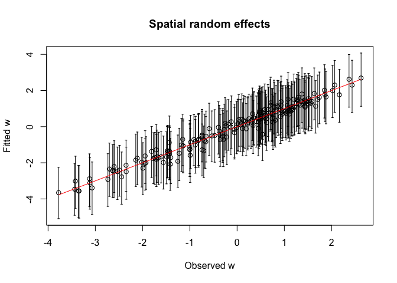<!-- -->
